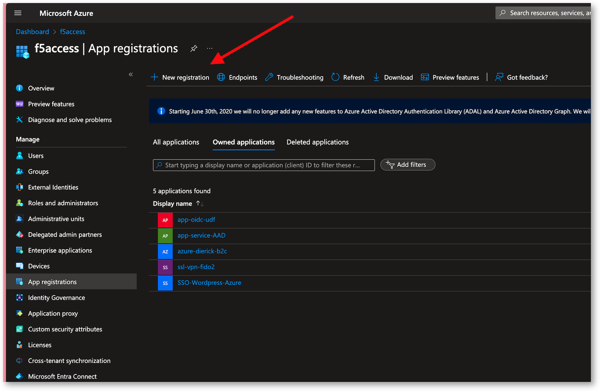
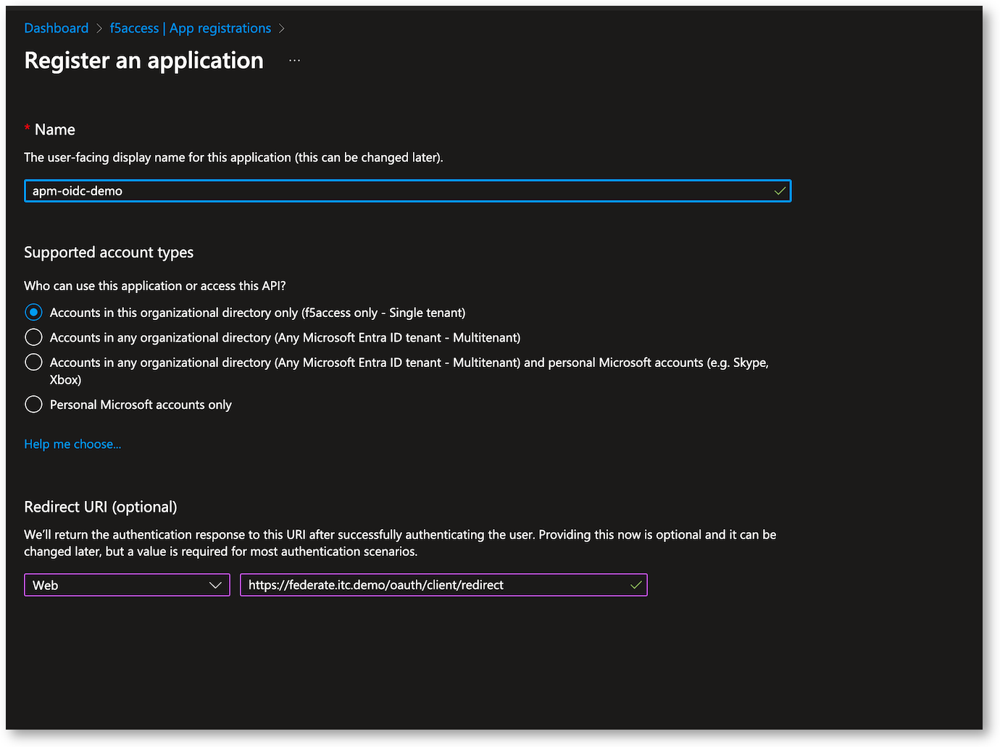

Lab 1 - READ ONLY - Create the Application in Azure Entra ID
############################################################

.. warning:: In this lab, you don't have to do anything. Everything is already created for you in Azure.

Create the Azure Entra ID Application
*************************************

In Azure Entra ID, go to ``App Registrations``

* Click on New Registration

* Give a name 
* For the redirect option, enter the FQDN of the app exposed on the APM, and append this suffix ``/oauth/client/redirect``

Example : https://federate.itc.demo/oauth/client/redirect

* Click Register

Configure your Entra ID app
***************************

* Find your Entra ID Application and Edit it
* Copy and Save those ID - we will use them into APM

  * Application ID (this is the OIDC client ID) : b55fd307-3270-4208-b059-8c3f292a7934
  * Tenant ID or Tenant name : f5access.onmicrosoft.com

  .. image:: ../pictures/lab1/ids.png
     :align: center
     :scale: 50%

* In Authentication menu, check the Web Redirect URIs. Must be the one defined previously. Don't change any other settings, we will use OIDC Autorization Grant Flow.

  .. image:: ../pictures/lab1/redirect.png
     :align: center
     :scale: 50%
     
* In Certificate and Secrets, create a ``Client Secret`` and save the ``Value`` not the ``Secret ID``. This is the OIDC Secret ID we will use in APM.

  .. image:: ../pictures/lab1/secret-id.png
     :align: center
     :scale: 70%

* In API persmissions, add those 2 persmissions in Delegated type

  * Microsoft Graph - openid
  * Microsoft Graph - User.Read

   .. image:: ../pictures/lab1/api-permissions.png
      :align: center
      :scale: 70%

* In Expose an API, check the Application ID URI exists
* Click ``Add a scope``, and create a scope with a name such as ``federate``
* This scope will used by APM

  .. image:: ../pictures/lab1/expose-api.png
     :align: center
     :scale: 70%

* Add your account into ``Owners`` in order to find this app easily

* In ``Manifest``, modify the ``accessTokenAcceptedVersion`` to the value ``2``

  .. code-block:: JSON

   {
	"id": "7027be78-d322-4dca-b44d-b15963fbdf76",
	"acceptMappedClaims": null,
	"accessTokenAcceptedVersion": 2,
	"addIns": [],
	"allowPublicClient": null,
	"appId": "b55fd307-3270-4208-b059-8c3f292a7934",
	"appRoles": [],
	"oauth2AllowUrlPathMatching": false,
	"createdDateTime": "2024-06-06T18:44:15Z",
	"description": null,
   ...
   }

