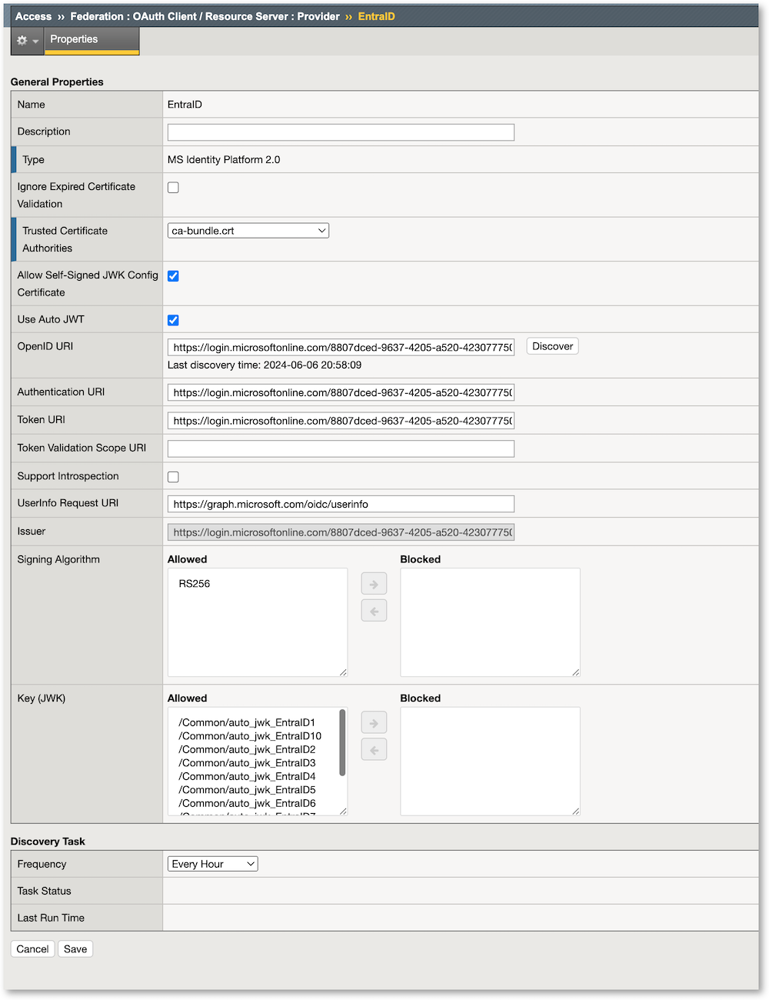

Lab 2 - Configure APM as OIDC Client and Resource Server
########################################################

Create all Oauth OIDC objects
*****************************

Create an Oauth Provider
========================

* Access > Federation > Oauth Client / RS > Provider
* Create a new provider, type ``MS Identity Platform 2.0``
* In the OpenID URI change ``_tenantid_`` by the Azure Entra ID tenant name or tenant ID -> 8807dced-9637-4205-a520-423077750c60

  * URL must be https://login.microsoftonline.com/8807dced-9637-4205-a520-423077750c60/v2.0/.well-known/openid-configuration

* Click Discover. This creates all the related objects and keys.
* Change Discovery Task Frequency to ``Hours``

Create the policy and VPE
*************************

Create the Virtual Server and assign the APM policy
***************************************************

