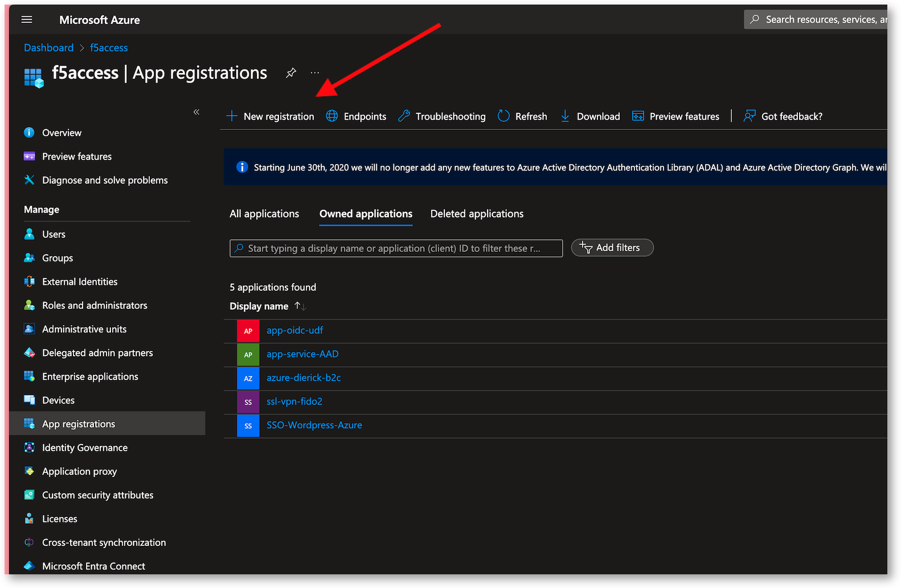

Lab 1 - READ ONLY - Create Azure Entra ID with PKCE
###################################################

.. warning:: In this lab, you don't have to do anything. Everything is already created for you in Azure.

This lab is similar to the previous lab, except we will use PKCE grant flow. In the previous lab, we had to define the Client Secret in the Edge Client configuration (connectivity profile).
It means, the Oauth client (Edge Client) knows and save this Secret in its system. This client must be trusted. If it is not the case (for instance a mobile app available in a app store), you must use another mecanism called PKCE.
With PKCE, the Oauth Client does not need to know the client secret.

More details : https://my.f5.com/manage/s/article/K14432144

Create a new Azure Entra ID Application
***************************************

* In Azure Entra ID, go to ``App Registrations``

* Click on New Registration

* Give a name
* For the redirect option

  * Select Single-page application (SPA) -> this is the way to enable PKCE instead of Client Secret.
  * Enter the Edge Client OIDC redirect URI http://localhost:8000

Example : https://federate.itc.demo/oauth/client/redirect

* Click Register

.. image:: ../pictures/lab1/spa-app.png
   :align: center
   :scale: 70%

Configure your Entra ID app
***************************

* Find your Entra ID Application and Edit it
* Copy and Save those ID - we will use them into APM

  * Application ID (this is the OIDC client ID) : e6f40de5-d0a4-4cc5-b680-48528fbd84e4
  * Tenant ID or Tenant name : f5access.onmicrosoft.com

  .. image:: ../pictures/lab1/ids.png
     :align: center
     :scale: 50%

* In Authentication menu, check the Web Redirect URIs. Must be the one defined previously. Don't change any other settings.

  .. image:: ../pictures/lab1/redirect.png
     :align: center
     :scale: 70%
     
* In API persmissions, only keep ``openid``

  * Microsoft Graph - openid

   .. image:: ../pictures/lab1/api-permissions.png
      :align: center
      :scale: 70%

* In Expose an API, check the Application ID URI exists, else click ``Add`` and save.
* Click ``Add a scope``, and create a scope with a name such as ``vpn``
* 
  * This scope will used by APM

    .. image:: ../pictures/lab1/scope.png
       :align: center
       :scale: 70%

* Add your account into ``Owners`` in order to find this app easily

* In ``Manifest``, modify the ``accessTokenAcceptedVersion`` to the value ``2``

  .. code-block:: JSON

   {
	"id": "7027be78-d322-4dca-b44d-b15963fbdf76",
	"acceptMappedClaims": null,
	"accessTokenAcceptedVersion": 2,
	"addIns": [],
	"allowPublicClient": null,
	"appId": "b55fd307-3270-4208-b059-8c3f292a7934",
	"appRoles": [],
	"oauth2AllowUrlPathMatching": false,
	"createdDateTime": "2024-06-06T18:44:15Z",
	"description": null,
   ...
   }

* Save

.. note:: Your Azure Entra ID is ready to be used by APM to authenticate users with PKCE grant flow.