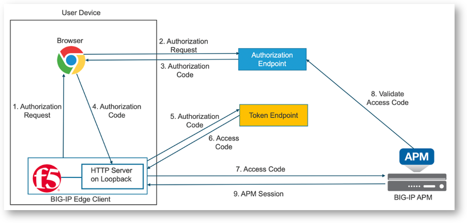
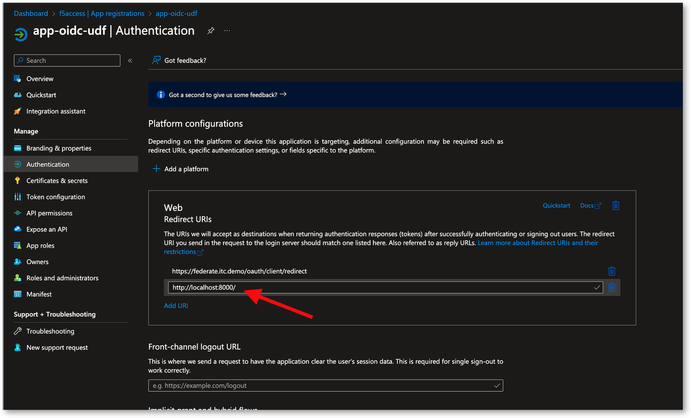

Lab 1 - READ ONLY - Modify Azure Entra ID
#########################################

.. warning:: In this lab, you don't have to do anything. Everything is already created for you in Azure.

Before moving forward into this lab, you must understand the architecture.
You can find more details in this article : https://community.f5.com/kb/technicalarticles/vpn-access-with-mfa-using-edge-client-7-2-1-and-apm-16-0/286298

But in a nutshell, in this use case, the OAuth client is not anymore APM, but the Edge Client. It means, the token will be requested by the Edge Client toward Azure Entra ID, and APM will validate it.
In the previous use case, APM was the Oauth client. APM redirected the user to Entra ID in order to request a token. Here, Edge Client will redirect the user to Entra ID.

But Edge Client does not have an embedded browser supporting modern IDP/AS. It means Edge Client will open up a default browser window so that user can authenticate in Entra ID.

Modify the Azure Entra ID Application
*************************************

In the previous we saw how the Azure Entra ID app was created. There is an important setting called "Redirect URI". This is the URI used by the Oauth Client. Here, Edge Client redirect URI is http://localhost:8000/

.. note:: This is value is static and hardcoded into Edge Client.

We must add this Redirect URI into the Azure Entra ID app.

.. note:: There is nothing more to do, we will use the same Client ID and Client Secret