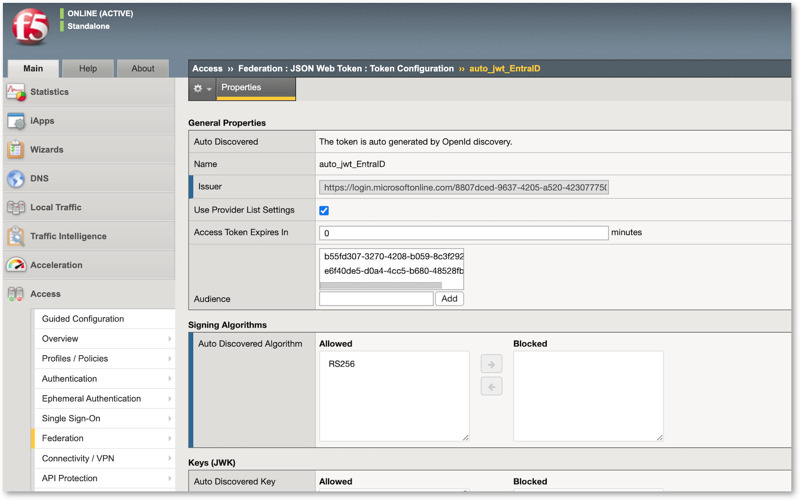
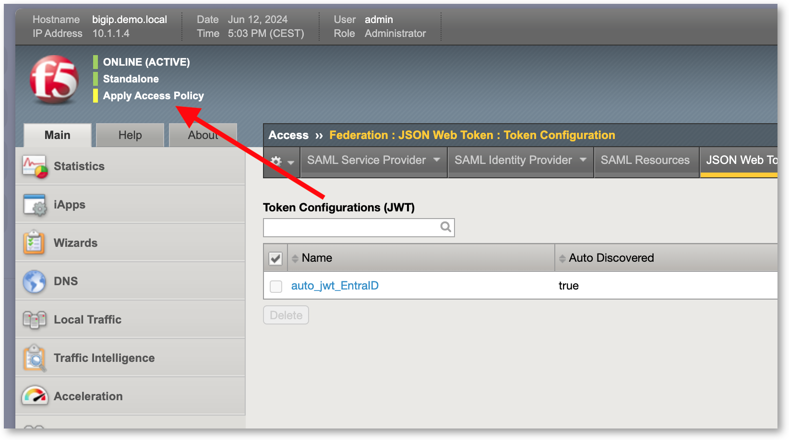
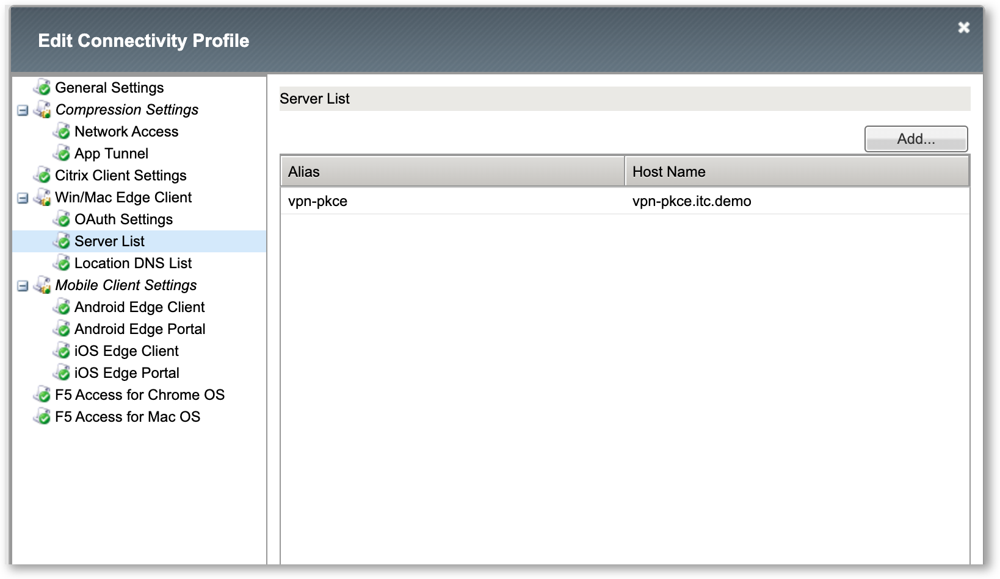

Lab 2 - Create the APM configuration and policy
###############################################

In this lab, we will re-use all the objects created in the previous lab. If you did not run through the previous lab, please do first.

We are going to create a new ``connectivity`` profile to use with PKCE, and will add the Azure Entra ID application as known app into APM.

Update the JWT token configuration
==================================

The new Azure Entra ID application created must be added as an audiance into the JWT configuration.

* Access > Federation > JSON Web Token > Token configuration
* Edit the existing object
* In Audience, add the Oauth ClientID as Audience : e6f40de5-d0a4-4cc5-b680-48528fbd84e4

.. warning:: Don't forget to click on add button so that the value is added into the list

* Save

* Apply the Policy. You made a change in the policy, so you must apply it.
* You have to click 2 times to apply !!!!!! Once on the top corner, once on the main page.

Create the PKCE Connectivity profile
************************************

This is where the OIDC Client mode is set (with or without PKCE). We will create a custom Connectivity profile so that Edge Client uses OIDC as authentication with PKCE. Else, Edge client will use the embedded browser (webview)

* Access > Connectivity / VPN > Connectivity > Profiles
* Create a new Connectivity profile
* Give a name : edge-oidc-pkce
* Parent profile : /Common/connectivity
* In Win/Mac Edge Client section, under Oauth settings, set the right OIDC Client values (same as previous use case)

  * Provider : EntraID (your provider created in previous lab)
  * Client ID : e6f40de5-d0a4-4cc5-b680-48528fbd84e4
  * Client Sec*** : empty - nothing to add as PKCE does not use secret
  * Scopes : api://e6f40de5-d0a4-4cc5-b680-48528fbd84e4/vpn

* In Win/Mac Edge Client section, under Server List, add en entry

  * Alias : vpn-pkce
  * Host Name : vpn-pkce.itc.demo

* Save

Create a new Virtual Server
***************************

* Create a new VS
* Name : vs-vpn-pkce
* Destination Address : 10.1.10.102
* Port : 443
* HTTP Profile : http
* Client SSL profile : client-itc-demo
* Source Address Translation : Auto Map
* Access Profile : vpn-oidc
* Connectivity profile : edge-oidc-pkce
* Save

