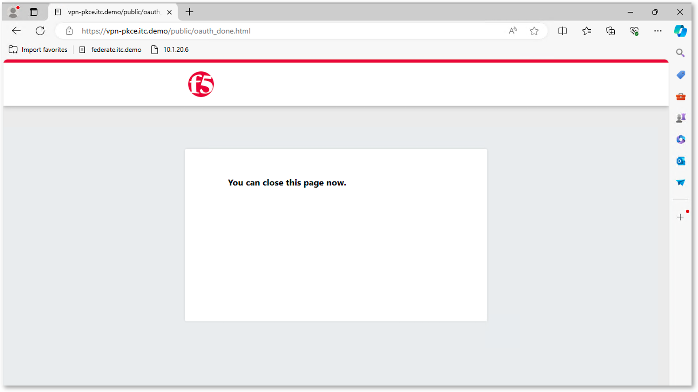
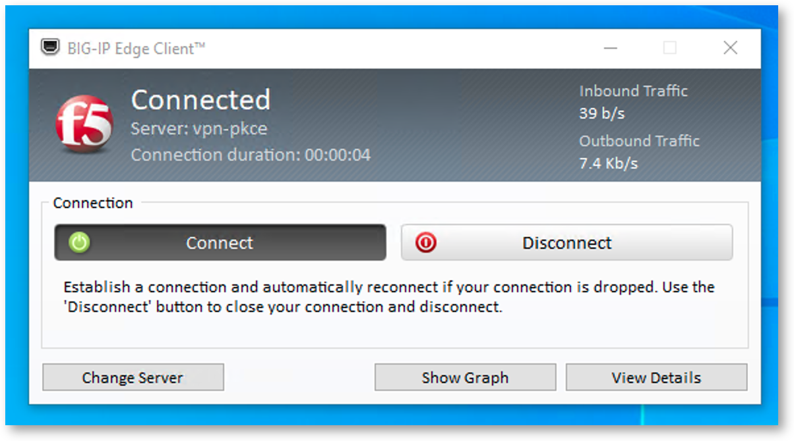

Lab 3 - Test your deployment
############################

Edge Client is already installed on the machine. It is basic and standard installation. No customization has been included.

* RDP to Win10 VM
* Login as ``user``, and password is ``user`` 
* Open Edge Client and click on Connect (if not selected already)
* A Default Browser (edge browser) will pop up and ask you to authenticated with Azure Entra ID

* Authenticate with user1@f5access.onmicrosoft.com
* Password is : F5twister$

* When authentication is done, the Edge Browser window will tell you to close the window

* Close the window and reopen Edge Client (from the taskbar)
* You are connected

* Open Edge Browser and navigate to a private web site on the private network http://10.1.20.6

* You can disconnect Edge Client.